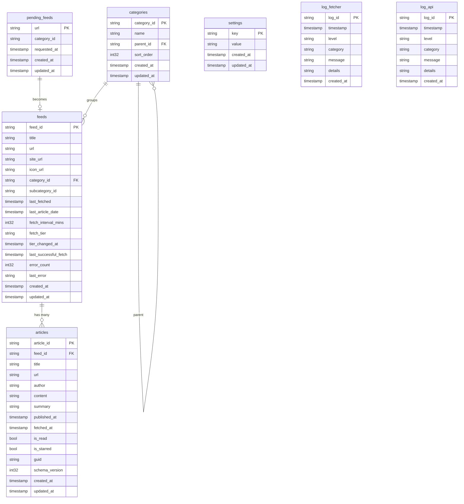

# Database Schema & Concurrency

## Timestamp Convention

All tables include `created_at` and `updated_at` columns:

- **`created_at`**: Set to current UTC time on insert. Never updated.
- **`updated_at`**: Set to current UTC time on insert and refreshed to UTC now on every update.
- **Type**: `timestamp[us]` (microsecond precision, no timezone annotation). Values are always UTC.
- **Management**: Application-managed - the Python fetcher and Go server both set these explicitly.

## Tables

### feeds.lance

| Column | Type | Description |
|---|---|---|
| `feed_id` | string | UUID primary key |
| `title` | string | Feed title |
| `url` | string | RSS/Atom feed URL |
| `site_url` | string | Website URL |
| `icon_url` | string | Favicon URL |
| `category_id` | string | FK → categories |
| `subcategory_id` | string | Sub-category reference |
| `last_fetched` | timestamp | Last fetch attempt |
| `last_article_date` | timestamp | Newest article date |
| `fetch_interval_mins` | int32 | Minutes between fetches |
| `fetch_tier` | string | `active` / `slowing` / `quiet` / `dormant` / `dead` |
| `tier_changed_at` | timestamp | When tier last changed |
| `last_successful_fetch` | timestamp | Last successful fetch |
| `error_count` | int32 | Consecutive failures |
| `last_error` | string | Most recent error |
| `created_at` | timestamp | When added |
| `updated_at` | timestamp | Last modification |

### articles.lance

| Column | Type | Description |
|---|---|---|
| `article_id` | string | UUID primary key |
| `feed_id` | string | FK → feeds |
| `title` | string | Headline |
| `url` | string | Permalink |
| `author` | string | Author name |
| `content` | string | Full HTML content |
| `summary` | string | Short description |
| `published_at` | timestamp | Publication date |
| `fetched_at` | timestamp | When fetcher downloaded this |
| `is_read` | bool | Read status |
| `is_starred` | bool | Starred status |
| `guid` | string | RSS guid / Atom id (dedup key) |
| `schema_version` | int32 | Schema version at write time |
| `created_at` | timestamp | When record was created |
| `updated_at` | timestamp | Last modification |

### categories.lance

| Column | Type | Description |
|---|---|---|
| `category_id` | string | UUID primary key |
| `name` | string | Display name |
| `parent_id` | string | FK → self for nesting |
| `sort_order` | int32 | UI ordering hint |
| `created_at` | timestamp | When added |
| `updated_at` | timestamp | Last modification |

### pending_feeds.lance

| Column | Type | Description |
|---|---|---|
| `url` | string | RSS/Atom URL to subscribe to |
| `category_id` | string | Optional category |
| `requested_at` | timestamp | When the user clicked "Add Feed" |
| `created_at` | timestamp | When record was created |
| `updated_at` | timestamp | Last modification |

### settings.lance

| Column | Type | Description |
|---|---|---|
| `key` | string | Setting key (primary key) |
| `value` | string | JSON-encoded value |
| `created_at` | timestamp | When setting was first created |
| `updated_at` | timestamp | Last modification |

## Concurrency & Multi-Process Access

### Why Not SQLite?

SQLite is often the go-to for "file-based database", but it has fundamental
limitations that make it unsuitable for this architecture:

- **Single writer** - SQLite uses file-level locking. Only one process can write
  at a time; concurrent writers block or fail with `SQLITE_BUSY`.
- **No network storage** - SQLite requires a local POSIX filesystem. You cannot
  safely open a SQLite database over NFS, Samba, or S3. The FAQ explicitly
  warns against this.
- **Monolithic file** - the entire database is one `.db` file. Copying it while
  a writer is active can produce a corrupt backup. Tools like `.backup` or WAL
  checkpointing exist, but add complexity.
- **No concurrent cross-process reads during writes** - readers can be blocked
  by writers depending on journal mode.

Lance solves all of these. Multiple independent processes - even on different
machines - can read and write the same tables concurrently because Lance uses
**MVCC (Multi-Version Concurrency Control)** with optimistic concurrency and
automatic conflict resolution.

### How it works

The fetcher (Python) and server (Go) run as **separate processes** sharing the
same Lance tables on disk (or over NFS / S3).

Each write creates a new immutable table version. On commit, Lance atomically
writes a manifest file using `put-if-not-exists` (or `rename-if-not-exists`).
If two writers race, only one succeeds; the other detects the conflict and
either rebases or retries automatically depending on the operation types.

### Why our access pattern is safe

| Process | Table | Operation | Lance txn type |
|---------|-------|-----------|----------------|
| Fetcher | articles | Adds new rows | **Append** |
| Fetcher | feeds | Updates metadata (last_fetched, error_count, …) | **Update** |
| Server | articles | Updates `is_read` / `is_starred` | **Update** |
| Server | feeds | Reads only | **Read** |

Key compatibility rules from the
[Lance Transaction Specification](https://lance.org/format/table/transaction/):

- **Append + Append** - always compatible, no conflict.
- **Append + Update** - compatible (new fragments vs. existing fragments).
- **Update + Update on different rows** - automatically rebaseable (deletion
  masks are merged).
- **Reads** - always safe; MVCC gives each reader a consistent snapshot.

Because the fetcher only *appends* articles and the server only *updates*
`is_read`/`is_starred` on existing articles, the two processes never touch
overlapping rows in the same table and will never conflict.

### Do I need DynamoDB or an external lock manager?

**No.** An external manifest store (e.g. DynamoDB) is only needed when the
backing object store lacks atomic write primitives.

**Why DynamoDB?** Lance commits work by atomically writing a new manifest file
(e.g. `42.manifest`). On a local filesystem this uses `rename-if-not-exists`;
on S3 it uses `PUT-IF-NONE-MATCH` (conditional PUT). If two writers race, the
atomic operation guarantees exactly one wins. But some object stores (older S3,
R2, B2) don't support conditional writes at all - there's no way to say "only
write this if it doesn't already exist". Without that primitive, two writers
could both believe they successfully committed version 42, corrupting the table.
DynamoDB (or any key-value store with `put-if-not-exists`) fills this gap: Lance
writes the manifest path to DynamoDB first using a conditional put, and only the
winner proceeds. It's purely a commit-coordination mechanism - DynamoDB stores
only a single pointer per table version, not any actual data.

| Storage | Atomic ops? | External store needed? | Notes |
|---------|-------------|------------------------|-------|
| Local filesystem | Yes (rename) | No | |
| NFS | Yes | No | Supports atomic rename across clients |
| Samba (SMB/CIFS) | Yes | No | Supports atomic rename; works for LAN setups |
| SSHFS (FUSE) | **Maybe** | No | See caveat below |
| AWS S3 | Yes (`PUT-IF-NONE-MATCH`, added 2024) | No | Requires a recent SDK that sends the conditional header |
| S3 (old SDK / pre-2024) | No | Yes - use DynamoDB | Legacy path; upgrade SDK if possible |
| MinIO | Yes | No | Supports `PUT-IF-NONE-MATCH` (conditional writes) since RELEASE.2023-09-07 |
| Cloudflare R2 | **No** | Yes - use DynamoDB | R2 does not support conditional `PUT`; needs an external manifest store |
| Backblaze B2 | **No** | Yes - use DynamoDB | No conditional write support |
| Google GCS | Yes (`If-None-Match`) | No | Natively supports conditional object writes |
| Azure Blob | Yes (conditional headers) | No | Natively supports conditional object writes |

#### SSHFS / FUSE filesystems

SSHFS mounts a remote directory over SSH using FUSE. **It will generally work**
for a single-writer scenario, but behaviour under concurrent writers from
multiple machines depends on:

- **`rename` atomicity** - SSHFS translates `rename()` into an SFTP rename,
  which is atomic on the remote filesystem (e.g. ext4, XFS). So Lance's
  `rename-if-not-exists` commit primitive should succeed.
- **Metadata caching** - SSHFS aggressively caches `stat`/`readdir` results by
  default. A second process may not immediately see a new manifest file. Mount
  with `-o cache=no` or `-o cache_timeout=0` to disable this.
- **No server-side locking** - Unlike NFS, SSHFS has no lock manager. This is
  fine because Lance uses atomic file operations rather than advisory locks.


For the default local-disk, NFS, or Samba deployment, no additional
infrastructure is required.

### Cloud Storage = Cloud Security

When Lance tables live on S3 or R2, there is no application-level authentication
to worry about. Access control is handled entirely by the cloud provider:

- **AWS S3** - IAM roles/policies control who can read/write the bucket. The
  fetcher and server just need valid AWS credentials (environment variables,
  instance profiles, or IRSA). No passwords, no tokens, no API keys in
  `config.toml`.
- **Cloudflare R2** - uses S3-compatible API tokens and bucket-level
  permissions.
- **GCS / Azure** - their native IAM and conditional-write support work
  directly with Lance.

This means the security perimeter is your cloud IAM policy, not your
application code. You don't need firewalls, VPNs, or reverse proxies to protect
your data - the bucket policy is the firewall.

### Backup with rsync / Syncthing

Because the data is just files, you can use standard file-sync tools to keep copies across machines:

```bash
# rsync to a backup server
rsync -av --delete ./data/ user@backup-server:/backups/rss-lance/

# Or use Syncthing to keep two machines in sync automatically
# Just point Syncthing at the data/ folder on both machines
#
# WARNING: Syncthing is file-sync, NOT a shared filesystem. Only one
# rss-lance instance (fetcher + server pair) should write to a given
# dataset at a time. The backup copy is for disaster recovery, not
# for running a second reader/writer. Lance's MVCC concurrency model
# relies on atomic file operations on a shared filesystem (NFS, Samba,
# S3) - Syncthing's eventual-consistency replication cannot provide
# this. If two instances write independently and Syncthing merges the
# files, the manifest history will diverge and the table may corrupt.
```

Lance files are immutable once written - a new version never modifies existing
files, so `rsync` / Syncthing always copies consistent data. Compare this with
SQLite, where copying the `.db` file mid-transaction can produce a corrupt
backup.

## Entity Relationship Diagram




## How the Fetcher Writes to DB Tables

The fetcher runs as a Python process (daemon or one-shot via `--once`). Each
fetch cycle follows this sequence:

### 1. Determine which feeds are due

`get_feeds_due()` reads **feeds.lance** and compares each feed's
`last_fetched` + `fetch_interval_mins` against the current time. Feeds with
tier `dead` are skipped. Settings like tier thresholds and intervals come from
**settings.lance**.

### 2. Fetch feeds concurrently

Up to `max_concurrent` feeds are fetched in parallel via a thread pool. For
each feed, `fetch_one()`:

1. **Downloads** the RSS/Atom XML using `requests` (via `feed_parser.py`).
2. **Parses** entries with `feedparser`, sanitises HTML (strips tracking
   pixels, dangerous tags, social share links, tracking URL params).
3. **Deduplicates** - reads existing `guid` values from **articles.lance** for
   that feed and drops any articles already stored.
4. **Strips site chrome** - compares the HTML of multiple articles from the
   same feed and removes repeated boilerplate (nav bars, related posts, etc.).

### 3. Batched writes

To minimise Lance version churn (and S3 PUT costs), the fetcher batches all
writes for the entire cycle:

- `begin_batch()` - enters batching mode.
- `add_articles()` - buffers new article rows in memory.
- `update_feed_after_fetch()` - queues per-feed metadata updates
  (`last_fetched`, `error_count`, tier, etc.).
- `flush_batch()` - at the end of the cycle, does **one** `table.add()` for
  all articles (a single Lance append) and then applies each queued feed
  update.

### 4. Post-cycle maintenance

- **Compaction** - `compact_if_needed()` checks each table's fragment count
  against thresholds from **settings.lance** and runs `compact_files()` +
  `cleanup_old_versions()` when exceeded.
- **Log trimming** - `trim_logs()` caps **log_fetcher** at `log.max_entries`.
- **Tier changes** - if a feed hasn't had new articles for long enough, its
  `fetch_tier` is downgraded (active → slowing → quiet → dormant → dead),
  increasing the `fetch_interval_mins` each time. A feed that receives new
  articles is immediately promoted back to `active`.

### 5. Logging

Throughout the cycle, `log_event()` buffers log entries and
`flush_log_batch()` appends them to **log_fetcher.lance** in a single write.

## The pending_feeds Queue

`pending_feeds` is a **cross-process message queue** that decouples the UI
from the fetcher:

| Step | Who | What |
|------|-----|------|
| 1 | User | Clicks "Add Feed" in the frontend |
| 2 | Go server | `POST /api/feeds` → `QueueFeed()` → inserts a row into **pending_feeds.lance** with the URL and timestamp |
| 3 | Python fetcher | On its next `run_once()` cycle, reads **pending_feeds.lance**, creates a proper **feeds.lance** row for each URL, does the initial fetch, and deletes the pending row |

This design exists because the Go API server is a **read-heavy** process - it
serves the UI and shouldn't be doing slow network fetches. The Python fetcher
is the only process that creates feeds and writes articles, keeping the write
path simple and avoiding Lance write conflicts between processes.

The flow is:

```
Browser → POST /api/feeds → Go server inserts into pending_feeds
                                          ↓
                              Python fetcher picks up on next cycle
                                          ↓
                              Fetches RSS, creates feed row, stores articles
                                          ↓
                              Deletes the pending_feeds row
```